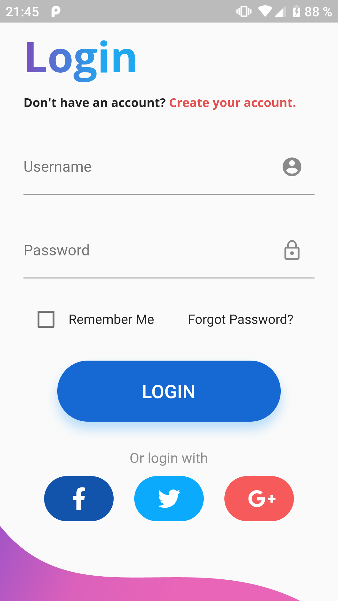

# Flutter Simple Login
Simple login application written with dart + flutter (Only Design)

# Screenshots
<!--  -->

# Design by
[Design by suresh UI](https://www.uplabs.com/posts/login-screen-b84c31d8-085d-406b-8787-04131d6a88ad) - Design from Uplabs

# Built with
[Dart](https://www.dart.dev) - Client-optimized language for fast apps on any platform\
[Flutter](https://www.flutter.dev) - Crossplatform App Development Framework

# Author
Denis Ostrovsky
 
# License

> © Denis Ostrovsky
